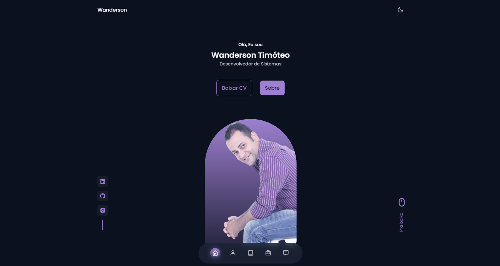
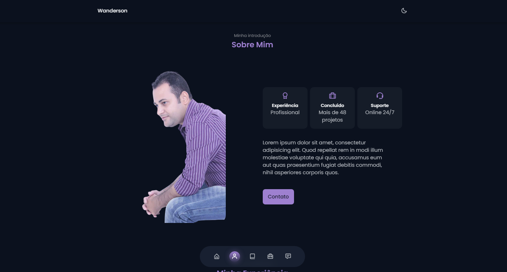
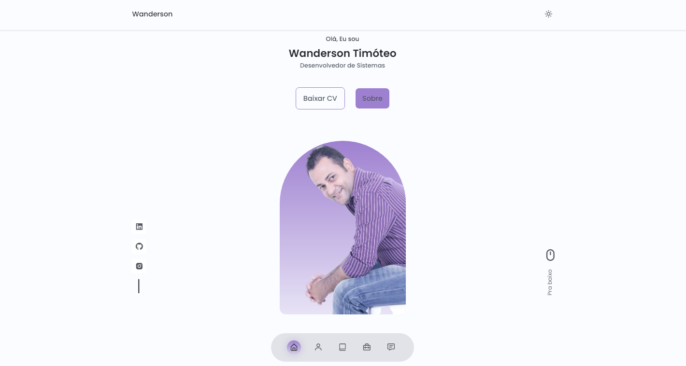
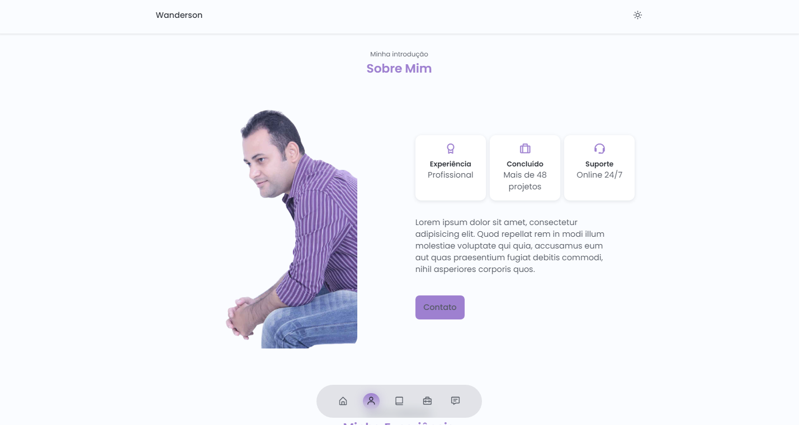
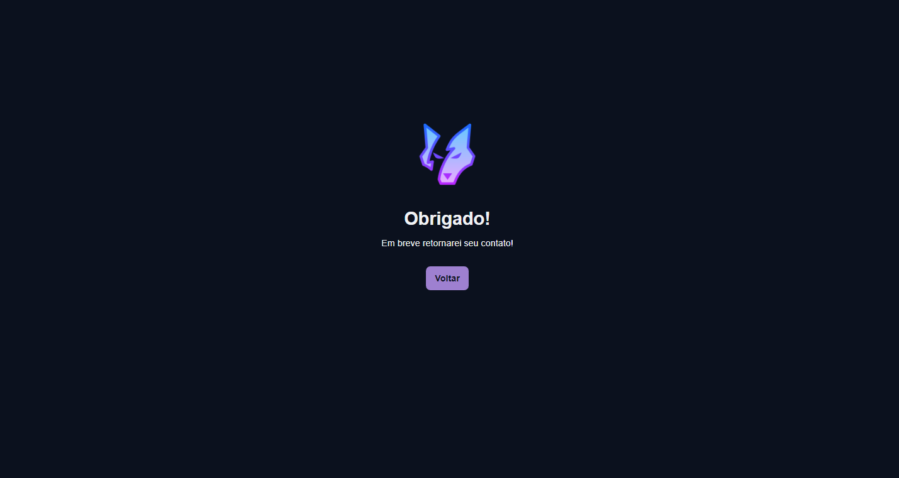
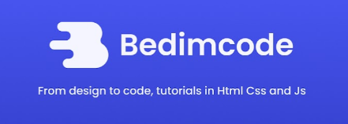

<h1 align="center">
  Wanderson Timóteo | Portfolio
</h1>

<div align="center">
  <a href="#-projeto">Projeto</a>&nbsp;&nbsp;&nbsp;|&nbsp;&nbsp;&nbsp;
  <a href="#-tecnologias">Tecnologias</a>&nbsp;&nbsp;&nbsp;|&nbsp;&nbsp;&nbsp;
  <a href="#-licença">Licença</a>&nbsp;&nbsp;&nbsp;|&nbsp;&nbsp;&nbsp;
  <a href="#-autor">Autor</a>
</div>

<br> 

<p align="center">
  
  
  
</p>

<br>

## 💻 Projeto

Este projeto consiste em um modelo de portfolio que pode ser usado por desenvolvedores, freelancers entre outros, para expor seus projetos e suas habilidades aos possíveis clientes e recruters. 
<br>

### Sessão Home Dark

<p align="center">
    
</p>
<br>

### Sessão Sobre Dark
<p align="center">
    
</p>
<br>

### Sessão Home Light 

<p align="center">
    
</p>
<br>

### Sessão Sobre Light
<p align="center">
    
</p>
<br>

### Página de Obrigado
<p align="center">
    
</p>
<br>

## 🚀 Tecnologias

Esse projeto foi desenvolvido com as seguintes tecnologias e ferramentas:

- [HTML5](https://www.w3schools.com/html/)
- [CSS3](https://www.w3schools.com/Css/)
- [Javascript](https://www.w3schools.com/js/DEFAULT.asp)
- [Swiper](https://swiperjs.com/)
- [ScrollReveal](https://scrollrevealjs.org/)
- [Google Fonts](https://fonts.google.com/)
- [Mixitup](https://www.kunkalabs.com/mixitup/)

<br>

## 🔥 Executar Aplicação

### 🎇 Executando Localmente a Aplicação

Caso você deseja executar o projeto na sua máquina local, você precisará instalar o Node.js, após a instalação, basta seguir os passos abaixo:

### 🌀 Começando...

Para começar, você deve simplesmente clonar o repositório do projeto na sua máquina.

Navegue até o local onde você clonou o projeto, exemplo:

```sh
C:\Users\NomeDoComputador\Documents\CloneDoProjeto
```

### 🛰️ Executando o projeto

Bom, agora que clonou o projeto **(dentro da pasta `portfolio-dark-light` do projeto clonado)** execute o projeto clicando duas vezes no arquivo index.html:

Pronto! dessa forma o projeto `portfolio-dark-light` estará rodando localmente em sua maquina.

<br>

## 🚩 Tenho Dúvidas... O que fazer?

Caso tenha dúvidas sobre o código do projeto, sintam-se a vontade em abrir uma **[ISSUE AQUI](https://github.com/Wanderson-A-Timoteo/portfolio-dark-light/issues)**. Assim que possível, responderei todas as dúvidas!

<br>

## 💡 Licença

Esse projeto está sob a licença MIT. Veja o arquivo [LICENSE](.github/LICENSE.md) para mais detalhes.

<br>

## 🎆 Autor

Feito com ♥ by

-  [**Wanderson A. Timóteo**](https://wanderson.tk)

<br>

## 🤝 Agradecimentos

<p align="center">
    
</p>
<br>


- Projeto desenvolvido assistindo a vídeo aula no Youtube do canal [Bedimcode](https://www.youtube.com/watch?v=oy8dSsK57Ps&t=993s).

- Agradecimento a [Bedimcode](https://www.youtube.com/c/Bedimcode) por compartilhar conteúdo relevante e com qualidade de ensino.
